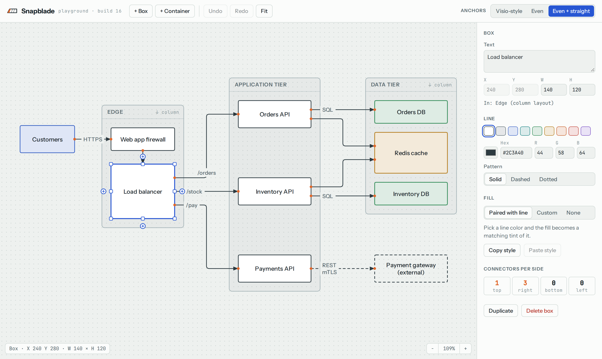
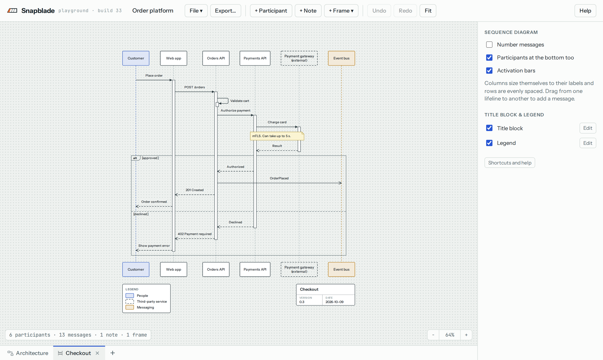

# Snapblade

**A diagram editor whose connectors tidy themselves.**

**[Try it in your browser →](https://mmunchinski.github.io/snapblade/)** Nothing to install. Your diagrams stay in your own browser.

You place the boxes. Snapblade keeps the connectors clean: anchor points evenly spaced along each side, lines straight wherever the boxes allow, bends centered in the gap between boxes, and parallel connectors bundled without crossing. When you resize or move something, everything re-tidies, instead of leaving you to re-glue a dozen arrows by hand.

Sequence diagrams go further: you never place anything. Add the participants, drag between lifelines for the messages, and Snapblade sizes the columns and spaces the rows. Keep the architecture and its sequence diagrams together as tabs in one file.





## Why

Manual tools (Visio, draw.io, Lucidchart) give you full control, and then you spend your time nudging connection points around after every resize. Diagrams-as-code tools (PlantUML, Mermaid) are fast, but you can't fix the layout they choose. Snapblade sits in between: manual placement, automatic tidiness.

## Features

- **Self-spacing anchors.** Connectors on a side spread evenly and re-space as boxes resize. The busiest side keeps even spacing, and lighter sides line up with it so lines run straight. A Visio-style mode is included for comparison.
- **Routing that respects your layout.** Right-angle connectors route around boxes and containers they don't belong to. Bends land halfway between the boxes they pass between, and bundles of connectors through the same gap are centered, evenly spaced and ordered so they don't cross.
- **Containers.** Boxes live inside containers, which can be free-form (grow to fit) or stack their contents in a row or column with even gaps.
- **Connect where you drop.** Drag a connector onto a shape: near an edge pins that side (the side lights up), in the middle the side is picked automatically (the whole shape lights up). A dot shows where the end will land. Dragging an existing connector's end works the same way.
- **Shapes that can't overlap.** Shapes side by side stay at least 20 px apart, so connectors always have room between them. A dragged shape stops at the wall and slides along it, a resized edge stops at it, and a container that grows pushes its neighbors out of the way. Hold Alt to overlap anyway, or turn it off for the diagram.
- **Connector labels.** Placed near the start, center or end, and kept clear of boxes, other labels and other connectors.
- **Arrange.** Line a selection up as a row or a column (tops, middles, bottoms, lefts, centers or rights) with kept, even or fixed spacing, without ever stacking shapes on top of each other. Straighten moves shapes just enough that their connectors run straight.
- **Sequence diagrams.** Participants and messages laid out automatically: columns as wide as their labels need, rows evenly spaced. Drag from one lifeline to another to add a message at that row, drag rows and participants to reorder, and press Enter after a label to go straight on to the next message. Sync, async and reply messages, self-messages, notes beside or across lifelines, message numbering. Activation bars draw themselves from each call to its reply. Alt, opt, loop and par frames around a run of rows, with else (or and) sections and conditions; frames nest and size themselves to the lifelines they cover, and you drag a frame's edge to take in more rows.
- **Tabs.** One file holds several diagrams, box or sequence, on tabs along the bottom. Add, duplicate, rename and drag tabs to reorder; each keeps its own undo history, view, title block and legend. Copy and paste work between tabs.
- **Styling.** Line and fill colors from presets, a picker, hex or RGB, with fills that pair automatically as a tint of the line color. Solid, dashed and dotted lines. Light and dark themes.
- **Fast editing.** Multi-select, same size, match colors, copy and paste style, copy, paste, duplicate, undo and redo.
- **Title block and legend.** Turn on a drawing-style title block (title, version, date, author) and a legend that builds itself from the colors and line styles in use. You just say what each one means. Both sit just outside the diagram in the corner you pick, and stay put as the diagram changes.
- **Diagrams from an AI assistant.** Snapblade files are plain JSON. Give an AI assistant the instructions at [llms.txt](https://mmunchinski.github.io/snapblade/llms.txt) (also in Help, under For AI agents, with a Copy button), describe the diagram, and open the file it writes: a box diagram, a sequence diagram, or several of them as tabs. The instructions are generated from the app's own rules, so they match the current version.
- **Files.** Save and open `.snapblade` files (plain JSON). In Chrome and Edge, Save writes straight back to the same file; other browsers download it. You can also drop a file onto the canvas to open it.
- **Export.** SVG, PNG (1×, 2× or 3×) and vector PDF (fit to the diagram, Letter or A4), in light or dark, on white, the canvas color or a transparent background, for the whole diagram or just the selection. Export the open tab or all of them: a PDF with a page per tab, or a file per tab. PNG and SVG can go straight to the clipboard for pasting into slides, chat or wikis.

## Getting started

Use it at **https://mmunchinski.github.io/snapblade/**, or open `index.html` from a clone in any modern browser (Chrome, Edge, Firefox or Safari). It's a single HTML file with no build step. Your diagram is saved in the browser as you work.

| Action | How |
|---|---|
| Add a box | Double-click empty canvas, or **+ Box** |
| Connect two boxes | Hover a box, drag one of its **+** handles onto another box |
| Start a sequence diagram | File > New sequence diagram, or **+** on the tab strip |
| Add a message | Drag from one lifeline to another, type the label and press Enter; then click the lifeline the next one goes to |
| Put messages in a frame | Click the first row, Shift+click the last, then **+ Frame** and pick alt, opt, loop or par |
| Rename | Double-click, press F2, or select and start typing |
| Select several | Drag a box on empty canvas, or Shift/Ctrl-click |
| Pan / zoom | Right-drag (or middle-drag, or Space+drag) / mouse wheel |
| Copy, paste, duplicate | Ctrl+C, Ctrl+V, Ctrl+D |
| Copy / paste style | Ctrl+Shift+C, Ctrl+Shift+V |
| Save / open a file | Ctrl+S (Ctrl+Shift+S to save as), Ctrl+O |
| Rename a tab | Double-click it |
| Everything else | Help (F1) has a guide to every control |

## Development

```sh
npm install
npx playwright install chromium   # first time only
npm test                          # layout tests (Node) + interaction tests (headless Chromium)
```

- `tests/layout.test.mjs` exercises the core without a browser: anchors, routing, bundling, labels, arrange, hard walls, sequence layout, the file format and the checks every opened file goes through.
- `tests/browser.test.mjs` drives the real app with mouse and keyboard input, including files, exports, tabs and hostile files.

## Privacy

Nothing you draw leaves your browser. Your work is kept in the browser's local storage, and files are only saved where you save them. The only network requests are downloads: the page itself, its fonts from Google Fonts (Instrument Sans and JetBrains Mono, on every visit), and, the first time you export a PDF, two open-source libraries ([jsPDF](https://github.com/parallax/jsPDF) and [svg2pdf.js](https://github.com/yWorks/svg2pdf.js)) from jsDelivr, checked against pinned hashes. SVG and PNG exports embed Instrument Sans so they look the same everywhere. If the fonts can't load, the app falls back to system fonts.

## License

Copyright (C) 2026 Matt Munchinski.

Snapblade is free software, licensed under the [GNU Affero General Public License v3.0](LICENSE). You may use, modify and share it. If you distribute a modified version, or run one as a hosted service, you must make its source available under the same license.

"Snapblade" is the name of this project. Forks are welcome under the license, but please give yours a different name.
